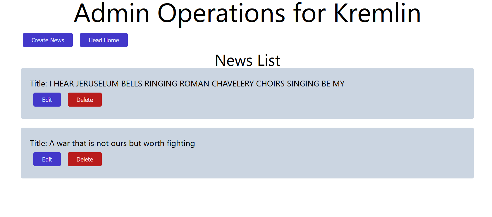
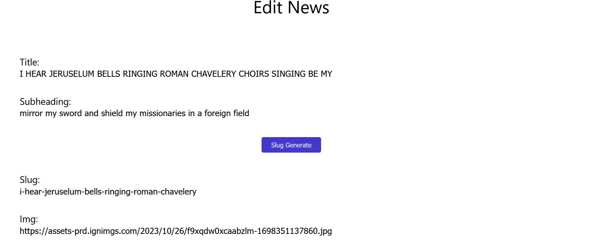
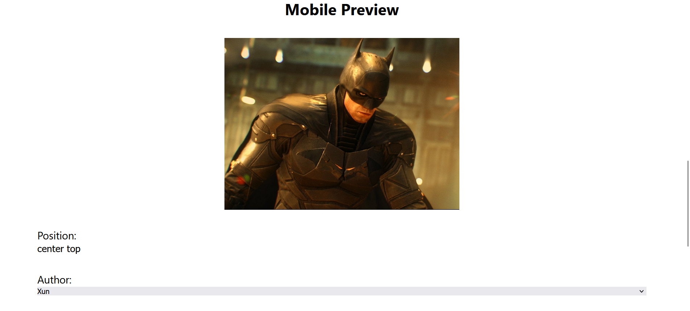
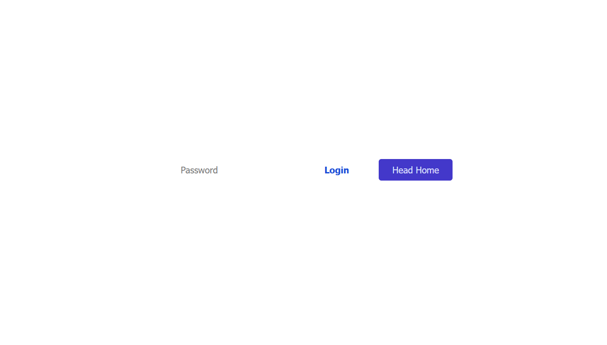

# The Third Front

## Introduction
The Third Front is a web app designed to deliver harmless and humorous satire news posts, offering a refreshing break from mainstream media's fear-centric approach. Our mission is to **present the truth under the veil of satire**.

### Goal
Our goal is to provide the community with a dose of humorous jokes, making news less intimidating and morbid for the average reader.

## Getting Started
### Prerequisites
- List of required software and tools with download/installation links.

### Installation
1. Clone the repository.
2. Navigate to /Frontend and install frontend dependencies using `npm install`.
3. Navigate to /Backend and install backend dependencies using `npm install`.

## Architecture
### Tech Stack
- Vite.js/React.js
- Node.js
- Express
- MongoDB

### Folder Structure
```
/Truly-Trustable-News/
├── /Backend/
│   ├── /src/
│   │   ├── /model/
│   │   │   ├── /Categories
│   │   │   └── /News
│   │   └── /methods/
│   │       ├── /News_Operation
│   │       └── /Category_Operation
│   ├── index.js
│   ├── vercel.json
│   └── .env
├── /Frontend/
│   ├── /src/
│   │   ├── /__test__
│   │   ├── /assets/images
│   │   ├── /component/
│   │   │   └── /CRUD
│   │   └── main.jsx
│   ├── /index.html
│   ├── .env
│   └── vercel.json
├── gitignore
└── Readme.md
```


## Configuration
### Environment Variables
Set up environment variables:
- **For /Frontend:**
  1. `VITE_base_url`: Your backend API URL (e.g., 'http://localhost:port').
- **For /Backend:**
  1. `MONGODB_URI`: MongoDB cluster URI.
  2. `PASSWORD`: Password for CRUD operations (set up during password setup).

## Development
### Running the App Locally
1. To run the Frontend locally, use `npm run dev`.
2. To run the backend locally, use `npm run dev`.

### Testing
Unit testing is performed for data fetching and authorization using the built-in **vitest** feature of Vite.js, similar to Jest testing library.

## API Documentation
### Endpoints
**Admin only**
1. post('/create-news',news_operations.create_News_post);
2. post('/delete/:id',news_operations.delete_news);
3. post('/edit/:id', news_operations.edit_News_post);
4. get('/admin', news_operations.allNews);
4. get('/edit/:id', news_operations.edit_news_get);
- AdminPage looks like this
 

- CreateNews/EditNews Page
 
**Hero Image Previewing(720p>) before saving the image position**
 
 **Hero Image Previewing(720p<) before saving the image position**
 
 

**client**
1. get('/', news_operations.allNewsHome);
2. get('/news/:id', news_operations.getNews);
3. get('/categories',category_Operations.allCategories);
4. get('/category/:id', category_Operations.category_news_list);


### Authentication
The app uses a simple sessionStorage-based authentication since there is only one user performing admin operations.
Login Page looks like this
 

## Database
### Database Schema
Two main schemas are used:
1. NewsSchema
2. CategorySchema

## Deployment
### Deployment Process
The full-stack web app is deployed on Vercel.

**Deploying the Backend:**
1. Configure vercel.json in the root folder of Backend.
2. Create a new project on vercel.com from your GitHub repo, choosing Backend as the source directory.
3. Set up environment variables for the Backend (MongoDB URI and password) and click on deploy.

**Deploying the Frontend:**
1. Choose the GitHub repo, and select Frontend as the source directory.
2. Set the environment variable for the frontend (VITE_base_url is the URL obtained after deploying the backend).

## Additional Resources
### Links to Documentation
- [Why Vite.js][1]
- [React.js][2]
- [Deploying on Vercel][3]

[1]: https://vitejs.dev/guide/why
[2]: https://react.dev/learn
[3]: https://vercel.com/docs/frameworks/vite


### Contact Information
[Mail us][jeiolsatszs@gmail.com]

## Conclusion
It was an interesting project, nothing too fancy. My friend and I started working on it as soon as we finished The Odin Project's React module and then completed it once we finished the Node.js module. This project was important as it taught us how to manage the different aspects of developing a web app, including writing test cases, modularization, and most importantly, managing timing and expectations for the project. We are still working on it and changing things we think we can improve as we continue learning new things along the way.
